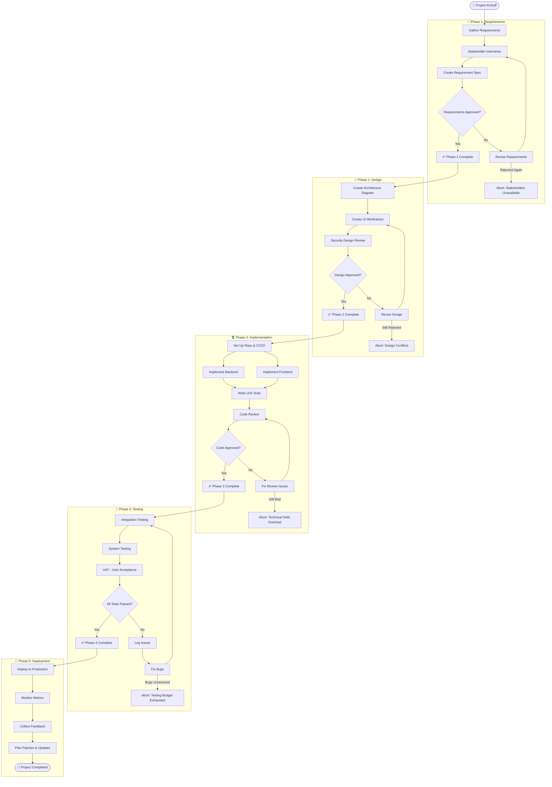

# Example

```mermaid
flowchart TD

    Start([🔷 Project Kickoff])

    %% ======================
    subgraph Phase1 [📘 Phase 1: Requirements]
        R1[Gather Requirements]
        R2[Stakeholder Interviews]
        R3[Create Requirement Spec]
        R4{Requirements Approved?}
        R5[Revise Requirements]
        R6[Abort: Stakeholders Unavailable]

        R1 --> R2 --> R3 --> R4
        R4 -- Yes --> R_Complete[✅ Phase 1 Complete]
        R4 -- No --> R5 --> R2
        R5 -->|Rejected Again| R6
    end

    %% ======================
    subgraph Phase2 [🧩 Phase 2: Design]
        D1[Create Architecture Diagram]
        D2[Create UI Wireframes]
        D3[Security Design Review]
        D4{Design Approved?}
        D5[Revise Design]
        D6[Abort: Design Conflicts]

        R_Complete --> D1 --> D2 --> D3 --> D4
        D4 -- Yes --> D_Complete[✅ Phase 2 Complete]
        D4 -- No --> D5 --> D2
        D5 -->|Still Rejected| D6
    end

    %% ======================
    subgraph Phase3 [🛠️ Phase 3: Implementation]
        I1[Set Up Repo & CI/CD]
        I2[Implement Backend]
        I3[Implement Frontend]
        I4[Write Unit Tests]
        I5[Code Review]
        I6{Code Approved?}
        I7[Fix Review Issues]
        I8[Abort: Technical Debt Overload]

        D_Complete --> I1 --> I2 & I3 --> I4 --> I5 --> I6
        I6 -- Yes --> I_Complete[✅ Phase 3 Complete]
        I6 -- No --> I7 --> I5
        I7 -->|Still Bad| I8
    end

    %% ======================
    subgraph Phase4 [🧪 Phase 4: Testing]
        T1[Integration Testing]
        T2[System Testing]
        T3[UAT - User Acceptance]
        T4{All Tests Passed?}
        T5[Log Issues]
        T6[Fix Bugs]
        T7[Abort: Testing Budget Exhausted]

        I_Complete --> T1 --> T2 --> T3 --> T4
        T4 -- Yes --> T_Complete[✅ Phase 4 Complete]
        T4 -- No --> T5 --> T6 --> T1
        T6 -->|Bugs Unresolved| T7
    end

    %% ======================
    subgraph Phase5 [🚀 Phase 5: Deployment]
        DEP1[Deploy to Production]
        DEP2[Monitor Metrics]
        DEP3[Collect Feedback]
        DEP4[Plan Patches & Updates]
        DEP5([🎉 Project Completed])

        T_Complete --> DEP1 --> DEP2 --> DEP3 --> DEP4 --> DEP5
    end

    Start --> R1
```
